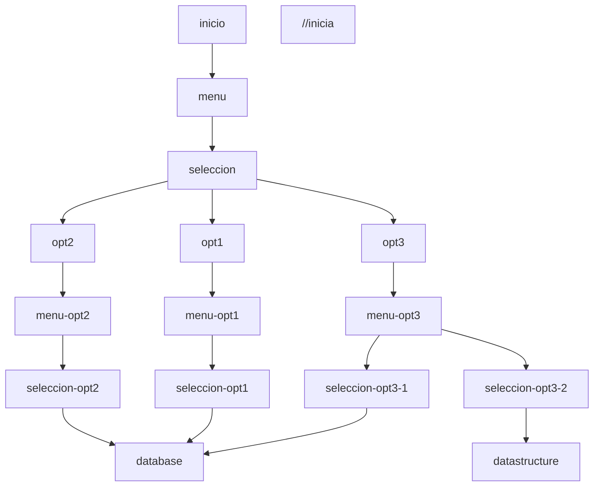

# proyecto en c++

## es un proyecto de administracion interna escrito en c++ utilizando ncurses y sus librerias adjuntas

para facilidad de los datos, utilizamos sqlite para administrar los datos de usuarios, asi como los registros de informacion general como las localizaciones, gestiones de los usuarios y todo lo demas.

puede descargar el ejecutable [aqui](./main.cpp)

y puede descargar el codigo fuente [aqui](./main.cpp)

